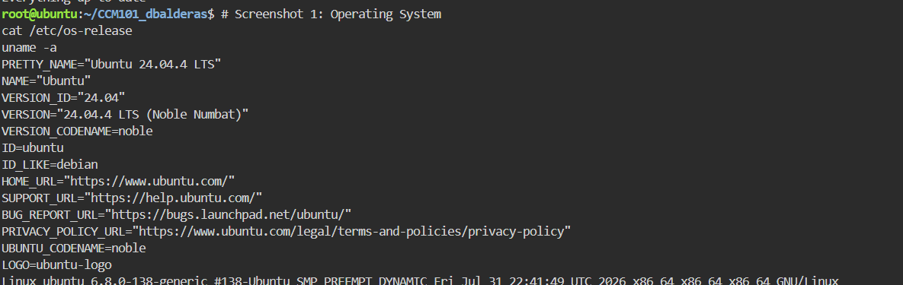
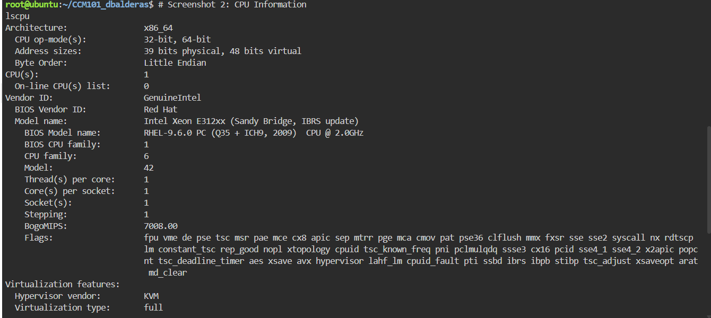
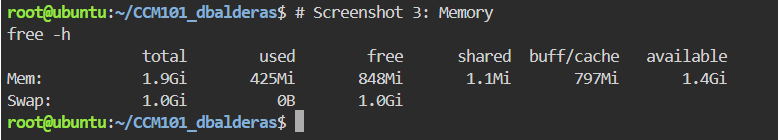
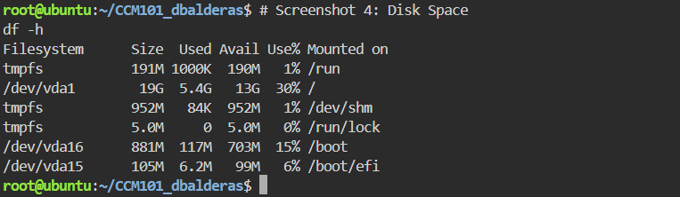

# Laboratory 03: Multi-Cloud Explorer

## Mission Overview
This lab documents my research and analysis of the three leading cloud platforms — Amazon Web Services (AWS), Microsoft Azure, and Google Cloud Platform (GCP) — as part of the Cloud Evaluation Team mission for CloudNova Technologies.

## Contents
- `aws-research.md` — AWS platform research
- `azure-research.md` — Azure platform research
- `gcp-research.md` — GCP platform research
- `cloud-platform-comparison.md` — Comparison table and service equivalence
- `client-recommendations.md` — Client scenario recommendations and decision matrix
- `reflection.md` — Mission reflection

## Linux System Investigation

**Operating System:**

PRETTY_NAME="Ubuntu 24.04.4 LTS"
NAME="Ubuntu"
VERSION_ID="24.04"
VERSION="24.04.4 LTS (Noble Numbat)"
VERSION_CODENAME=noble
ID=ubuntu
ID_LIKE=debian

Linux ubuntu 6.8.0-138-generic #138-Ubuntu SMP PREEMPT_DYNAMIC Fri Jul 31 22:41:49 UTC 2026 x86_64 x86_64 x86_64 GNU/Linux

**CPU Information:**

Architecture: x86_64
CPU(s): 1
Vendor ID: GenuineIntel
Model name: Intel Xeon E312xx (Sandy Bridge, IBRS update)
Thread(s) per core: 1
Core(s) per socket: 1
Socket(s): 1
Virtualization type: full (KVM hypervisor)
L1d/L1i cache: 32 KiB each
L2 cache: 4 MiB
L3 cache: 16 MiB

**Memory:**
          total        used        free      shared  buff/cache   available

Mem: 1.9Gi 411Mi 861Mi 1.1Mi 798Mi 1.5Gi
Swap: 1.0Gi 0B 1.0Gi

**Disk Space:**

Filesystem Size Used Avail Use% Mounted on
tmpfs 191M 996K 190M 1% /run
/dev/vda1 19G 5.4G 13G 30% /
tmpfs 952M 84K 952M 1% /dev/shm
tmpfs 5.0M 0 5.0M 0% /run/lock
/dev/vda16 881M 117M 703M 15% /boot
/dev/vda15 105M 6.2M 99M 6% /boot/efi

### Cloud Migration Analysis
If this Linux server were migrated to the cloud, it could be hosted using:
- **AWS:** EC2 t3.micro or t3.small instance — the observed 1 vCPU and ~2GB RAM footprint fits comfortably within a t3.micro (2 vCPU burstable, 1GB RAM) or t3.small (2GB RAM) tier, with EBS gp3 storage sized around 20GB to match the observed 19GB root volume.
- **Azure:** B1s or B1ms Virtual Machine — Azure's burstable B-series VMs are designed for low, steady baseline CPU usage like this server shows (only 411Mi memory in active use), making the B1ms (1 vCPU, 2GB RAM) a close match.
- **GCP:** e2-small Compute Engine instance — GCP's e2-small (2 vCPU shared, 2GB RAM) or a custom machine type with 1 vCPU/2GB RAM would match this server's profile, paired with a 20GB persistent disk.

The observed disk usage (5.4G of 19G, 30% used) and low memory pressure (861Mi free of 1.9Gi) indicate this is a lightweight workload that wouldn't need a large instance size on any of the three platforms — a small/burstable tier would be cost-effective and sufficient.
