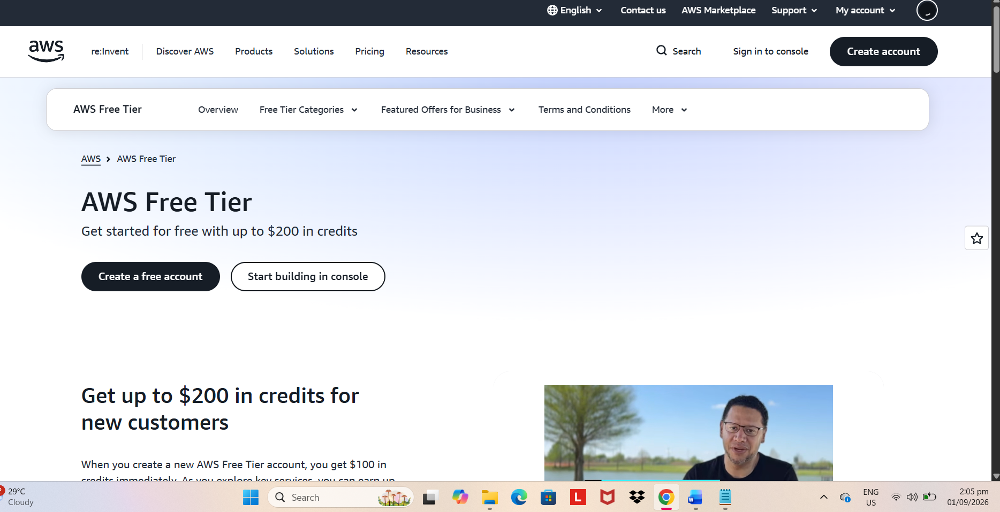

# AWS Research

## Brief Overview
Amazon Web Services (AWS) is the cloud computing platform launched by Amazon in 2006. It was the first major public cloud provider and remains the market leader, offering over 200 fully featured services spanning compute, storage, databases, networking, machine learning, analytics, and more, used by everything from startups to Fortune 500 companies and government agencies.

## Global Infrastructure
- Regions: 30+ geographic regions worldwide
- Availability Zones: 90+ (each region has multiple isolated AZs for redundancy)
- Edge Locations: 400+ (used by CloudFront CDN for low-latency content delivery)

## Cloud Management Console
The AWS Management Console is a web-based interface for accessing and managing AWS services. It provides a dashboard for launching resources, monitoring usage/billing, configuring IAM permissions, and accessing every AWS service through a searchable menu. AWS also offers the AWS CLI and SDKs for programmatic/automated management.

## Four (4) Core Services
1. **Amazon EC2 (Elastic Compute Cloud)** – Resizable virtual servers (instances) used to run applications; supports many OS types and instance sizes.
2. **Amazon S3 (Simple Storage Service)** – Object storage for storing and retrieving any amount of data, commonly used for backups, static websites, and data lakes.
3. **Amazon RDS (Relational Database Service)** – Managed relational database service supporting MySQL, PostgreSQL, SQL Server, and more, handling patching/backups automatically.
4. **AWS Lambda** – Serverless compute service that runs code in response to events without provisioning or managing servers.

## Three (3) Advantages
1. Widest breadth of services and largest global infrastructure footprint of any cloud provider.
2. Mature ecosystem with extensive third-party tool support, documentation, and community/enterprise adoption.
3. Pay-as-you-go pricing with fine-grained control over cost optimization (reserved instances, spot instances, savings plans).

## Typical Enterprise Use Cases
- Hosting scalable web applications and mobile app backends
- Big data analytics and data lake architectures
- Disaster recovery and backup solutions
